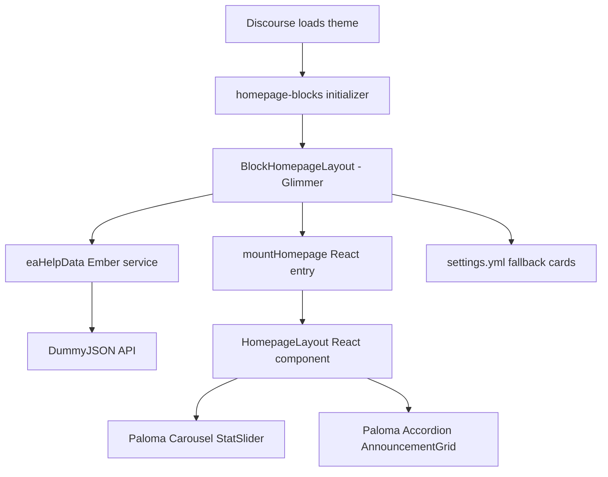

# EA Demo Theme Development Workflow

This repository is a Discourse theme. Discourse owns the application shell, routing, data services, rendering lifecycle, and theme compilation. The repository can be developed in two modes:

- `main`: the native Discourse/Ember/Glimmer implementation.
- `CMC-6646`: a hybrid implementation where Discourse still owns the integration boundary, while selected homepage UI is rendered with React and Paloma components.

The React branch is not a separate application. It is a React bundle uploaded as part of the Discourse theme.

## 1. Branch Comparison

| Area | `main` | `CMC-6646` |
| --- | --- | --- |
| UI runtime | Ember/Glimmer | Glimmer integration plus React UI |
| Homepage registration | Registers the stat slider and announcements as two blocks | Registers one Glimmer parent layout block |
| React/Vite | Not used | Vite builds `src/` into `javascripts/discourse/react-dist/` |
| Component library | Discourse components/helpers and theme SCSS | Paloma React components plus theme SCSS |
| API ownership | Glimmer block/service code | Glimmer parent service, React receives prepared props |
| Development command | `npm run watch` | `npm run dev:react` and `npm run watch` |
| Build risk | Low | Requires Node dependencies, private registry access, and a valid browser bundle |
| Best use | Native Discourse customization | Reusing an existing React/Paloma UI library |

The baseline `main` branch has only the Discourse Theme CLI scripts:

```json
{
  "scripts": {
    "watch": "discourse_theme watch .",
    "update": "discourse_theme update ."
  }
}
```

The `CMC-6646` branch adds React, ReactDOM, Paloma, Vite, and the Vite React plugin.

## 2. Prerequisites

Install these once on the development machine:

- Ruby, because the Discourse Theme CLI is a Ruby gem.
- Node.js and npm. Node 20 or newer is recommended because the Paloma package declares a Node 20 engine requirement.
- Access to the target Discourse instance.
- A Discourse API key for the Theme CLI.
- A GitLab package token for the private `@paloma` npm registry when working on `CMC-6646`.

Install the Theme CLI:

```powershell
gem install discourse_theme
discourse_theme -v
```

The repository `.npmrc` maps the `@paloma` scope to the EA GitLab registry. It reads the token from `GITLAB_NPM_TOKEN`:

```text
@paloma:registry=https://gitlab.ea.com/api/v4/projects/81777/packages/npm/
//gitlab.ea.com/api/v4/projects/81777/packages/npm/:_authToken=${GITLAB_NPM_TOKEN}
```

Set `GITLAB_NPM_TOKEN` in the local shell or user environment. Never commit the token to `.npmrc`, `package.json`, source files, or chat history. Rotate a token immediately if it is exposed.

## 3. Native `main` Workflow

Switch to the native branch:

```powershell
git switch main
```

From the theme root, install the Theme CLI gem if needed and start the watcher:

```powershell
npm run watch
```

This runs:

```text
npm run watch
  -> discourse_theme watch .
```

On the first run, the CLI asks for the Discourse site and theme to synchronize. It stores the site configuration and API key in the local Discourse Theme CLI configuration, not in the repository.

The watcher uploads changes to the selected theme and prints preview, manage, and test URLs. Save a file, wait for the upload to complete, and refresh the preview page.

For the native branch, the normal loop is:

```text
Edit .gjs, .js, .scss, settings.yml, or locales/en.yml
  -> Save
  -> Theme CLI uploads the theme
  -> Refresh the Discourse preview
```

There is no React build step on `main`.

### Native homepage flow

The `main` homepage initializer registers two blocks:

```js
api.renderBlocks("homepage-blocks", [
  { block: BlockStatSlider, id: "ea-stat-slider" },
  { block: BlockAnnouncements, id: "ea-announcements" },
]);
```

The order in this array is the render order. Each block is a Glimmer component registered with the Discourse Blocks API. The blocks can use Discourse services directly, for example `site`, `router`, or a custom Ember service.

## 4. React/Paloma `CMC-6646` Workflow

Switch to the hybrid branch:

```powershell
git switch CMC-6646
```

Set the private registry token in the current shell, then install dependencies:

```powershell
npm install
```

The branch contains these important npm scripts:

```json
{
  "scripts": {
    "build:react": "vite build",
    "dev:react": "vite build --watch",
    "prewatch": "npm run build:react",
    "watch": "discourse_theme watch .",
    "update": "discourse_theme update ."
  }
}
```

### Recommended two-terminal workflow

Use two terminals from the theme root.

Terminal 1 continuously rebuilds React:

```powershell
npm run dev:react
```

Terminal 2 uploads the theme to Discourse:

```powershell
npm run watch
```

The Theme CLI's `prewatch` hook performs one React build before the Discourse watcher starts. Running `dev:react` separately is useful because it rebuilds `src/**/*.jsx` whenever a React file changes.

The build output is written to:

```text
javascripts/discourse/react-dist/ea-react-widgets.js
```

The generated file is a theme asset and must be present when the Theme CLI uploads the theme. If the file is missing, the Discourse compiler cannot resolve the React bridge import.

### One-time build

Use this when you only want to verify the React bundle:

```powershell
npm run build:react
```

The bundle must remain below Discourse's per-file upload limit. If it becomes too large, reduce imports or split the output with Rollup chunks.

## 5. Hybrid Runtime Architecture

The React branch keeps a Glimmer component at the Discourse boundary. React is mounted only after Discourse has created a DOM element for that boundary.



The relevant files are:

- `javascripts/discourse/api-initializers/homepage-blocks.gjs`: registers `BlockHomepageLayout`.
- `javascripts/discourse/blocks/block-homepage-layout.gjs`: owns the Discourse lifecycle and API service.
- `javascripts/discourse/api-initializers/ea-react-bridge.js`: exposes the React mount API.
- `src/react-entry.jsx`: creates and tracks React roots.
- `src/components/homepage-layout.jsx`: composes the React homepage sections.
- `src/components/stat-slider.jsx`: renders the Paloma `Carousel`.
- `src/components/announcement-grid.jsx`: renders static Paloma `Accordion` items.
- `vite.config.js`: creates the browser bundle.

### Why the parent is Glimmer

The parent Glimmer block is the safest integration boundary because Discourse controls:

- When the homepage outlet is inserted.
- When the user changes routes.
- When the block is destroyed.
- Which Discourse services and settings are available.
- How the theme is compiled and uploaded.

The parent calls React only after its element exists:

```js
@action
mountHomepage(element) {
  this.mountElement = element;
  this.renderReact();
  this.loadHelpData();
}
```

It unmounts React when Discourse destroys the block:

```js
willDestroy() {
  unmount(this.mountElement);
  super.willDestroy(...arguments);
}
```

This prevents React roots from being left behind during Discourse route transitions.

## 6. Shared API Data

`ea-help-data.js` is an Ember service and therefore a singleton. The parent Glimmer block injects it with:

```js
@service eaHelpData;
```

The service memoizes its fetch promise. Multiple components can request the same data, but the browser makes one API request:

```js
if (this.loadPromise) {
  return this.loadPromise;
}
```

The parent converts API data into React props:

```js
mountHomepage(this.mountElement, {
  cards: this.cards,
});
```

React does not need to know where the data came from. It receives a normal array of cards. If the API has no usable `HelpByGame` data, the parent creates fallback cards from `settings.stat_slider_display_stats`.

This separation is intentional:

```text
Discourse service/API/settings concerns -> Glimmer parent
Visual UI and Paloma composition       -> React children
```

## 7. Paloma Component Usage

Paloma components are imported through named exports from their component subpaths:

```jsx
import { Accordion } from "@paloma/core-ui/components/Accordion";
import { Alert } from "@paloma/core-ui/components/Alert";
import { Badge } from "@paloma/core-ui/components/Badge";
import { Button } from "@paloma/core-ui/components/Button";
import { Carousel } from "@paloma/core-ui/components/Carousel";
import { Divider } from "@paloma/core-ui/components/Divider";
import { Link } from "@paloma/core-ui/components/Link";
import { Text } from "@paloma/core-ui/components/Text";
```

Use named imports. For example, this is correct:

```jsx
import { Accordion } from "@paloma/core-ui/components/Accordion";
```

This is incorrect because `Accordion.js` does not have a default export:

```jsx
import Accordion from "@paloma/core-ui/components/Accordion";
```

The current Paloma Carousel supports between two and five children. The slider limits API cards to five before rendering it. Paloma styles are imported with Vite's inline CSS query and injected once by `src/react-entry.jsx`; they are not imported from `common.scss` because Discourse Sass cannot resolve generated Vite output reliably.

## 8. File Change Workflow

### Native Discourse/Glimmer change

1. Edit or create a `.gjs` component/block.
2. Register a new block in an API initializer if needed.
3. Add or update SCSS and import it through the relevant `_index.scss`.
4. Add settings in `settings.yml`.
5. Add setting labels/descriptions in `locales/en.yml`.
6. Save and let `npm run watch` upload the theme.
7. Refresh the preview.

### React/Paloma change

1. Edit a file under `src/`.
2. Let `npm run dev:react` run Vite.
3. Confirm `javascripts/discourse/react-dist/ea-react-widgets.js` was regenerated.
4. Let `npm run watch` upload the generated asset.
5. Refresh the Discourse preview with `Ctrl+Shift+R` if the old CDN bundle is cached.
6. Check the browser console for React, Paloma, or Discourse errors.

### Adding a new React section

1. Create `src/components/example-section.jsx`.
2. Import and render it in `src/components/homepage-layout.jsx`.
3. Pass data from the Glimmer parent rather than fetching independently in every child.
4. Add page-specific styling to the theme SCSS or a component stylesheet.
5. Build the bundle and verify the generated file size.

## 9. Pros and Cons

### Native Glimmer on `main`

Advantages:

- Native Discourse lifecycle, routing, services, settings, and helpers.
- No second JavaScript runtime or build pipeline.
- Smaller deployment surface and simpler theme uploads.
- No private npm registry dependency.
- Easier to use Discourse-specific APIs and conventions.
- Lower risk during route transitions and theme preview reloads.

Disadvantages:

- React components cannot be reused directly.
- Engineers familiar only with React must learn Glimmer templates, tracked state, actions, and Ember services.
- Existing React design-system components need to be recreated or wrapped.
- Glimmer and Discourse conventions are specific to this platform.

### React/Paloma on `CMC-6646`

Advantages:

- Reuses existing React knowledge and Paloma components.
- Makes it practical to reuse a React design system such as Accordion, Carousel, Alert, Badge, Button, Link, and Text.
- React components can be developed and composed in familiar JSX.
- The parent boundary keeps Discourse-specific data and lifecycle logic out of visual children.
- Multiple React sections can share one React root and one API/service preparation step.

Disadvantages:

- Requires Node, npm, Vite, React, Paloma packages, and private registry access.
- Requires two development processes: the Vite build watcher and the Discourse Theme CLI watcher.
- Generated JavaScript must be uploaded as a theme asset.
- The browser receives a larger bundle than a native theme component.
- React must be mounted and unmounted correctly across Discourse route transitions.
- Paloma exports, CSS, peer versions, and runtime assumptions must match the installed package.
- Bundle size can exceed Discourse's one-megabyte per-file limit.
- CDN caching can make UI changes appear stale until a hard refresh.

## 10. Troubleshooting

### `Could not resolve ../react-dist/ea-react-widgets`

Run:

```powershell
npm run build:react
```

Confirm that `javascripts/discourse/react-dist/ea-react-widgets.js` exists. The React bridge imports this generated file.

### `Value is too long (maximum is 1048576 characters)`

The generated JavaScript file is over Discourse's per-file limit. Reduce imports, import Paloma components directly by subpath, or configure Rollup chunk splitting. Check every generated file size before starting the Theme CLI watcher.

### `ReferenceError: process is not defined`

A dependency contains a Node-style environment reference. The Vite configuration replaces it during the browser build:

```js
define: {
  "process.env.NODE_ENV": JSON.stringify("production"),
}
```

### `Can't find stylesheet to import`

Do not import a generated Vite CSS file from `common.scss`. The Sass compiler may run before the generated asset exists or may not resolve it as a theme stylesheet. The current React entry imports Paloma CSS with `?inline` and injects it into the document once.

### `default is not exported by Accordion.js`

Paloma components use named exports:

```jsx
import { Accordion } from "@paloma/core-ui/components/Accordion";
```

### The page is blank or cards are extremely narrow

Check that the homepage wrapper and React card have stable widths. Paloma Carousel measures its child card to calculate animation dimensions, so the card must not rely on an unconstrained intrinsic width.

### The API is requested more than once

Keep API loading in the shared `eaHelpData` service or the Glimmer parent. Do not create independent fetches in every React child. The service's memoized `loadPromise` is the single-request guard.

## 11. Recommended Team Practice

Use native Glimmer for Discourse integration, settings, routing, lifecycle, and shared data. Use React and Paloma for substantial visual sections where an existing React component library provides meaningful value.

Keep one Glimmer parent block and one React root for the homepage. Pass prepared data into React as props. Avoid mounting each small child independently, importing all of Paloma through a package barrel, or putting secrets into repository configuration.

Before opening a pull request, run:

```powershell
npm run build:react
git diff --check
```

Then run `npm run watch`, open the printed preview URL, test a fresh load and a Discourse route transition, and check the browser console for errors.
