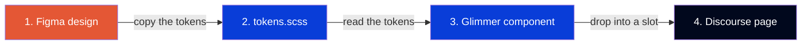

# Demo: EA Header + Announcements in plain Ember/Glimmer

> **Purpose of this branch:** show leadership that we can build EA Forums UI
> using Discourse's **native** tooling (Ember + Glimmer) — no React, no extra
> build pipeline. And that we can do it **faithfully from the EA Figma design**,
> by copying the design tokens straight out of Figma and building components in
> Glimmer. Two features: the EA header (logo, nav pills, search bar) and the
> announcements section.

## What's in the demo

| Feature | Component (Glimmer) | Placed by | Styles (token-driven) |
|---|---|---|---|
| **EA header** — logo + "Forums", "EA Help" / "Browse by Topic ▾" pills, search bar | [ea-header.gjs](../javascripts/discourse/components/ea-header.gjs) | [api-initializers/ea-header.js](../javascripts/discourse/api-initializers/ea-header.js) | [ea-header.scss](../stylesheets/components/ea-header.scss) |
| **Announcements** — hero + grid of cards | [blocks/block-announcements.gjs](../javascripts/discourse/blocks/block-announcements.gjs) | [api-initializers/homepage-blocks.gjs](../javascripts/discourse/api-initializers/homepage-blocks.gjs) | [block-announcements.scss](../stylesheets/blocks/block-announcements.scss) |
| **Design tokens** (colors, spacing, radius from Figma) | — | — | [tokens.scss](../stylesheets/brand/tokens.scss) |

## The process we're proving (the point of the demo)

**Figma design → tokens → Glimmer component → Discourse.** Four steps:



1. **Copy the design tokens from Figma.** The header's exact colors, spacing,
   and radius values live in [tokens.scss](../stylesheets/brand/tokens.scss) as
   CSS variables — each one labeled with its Figma name (e.g. `--ea-bg-base:
   #01081d` is Figma's "Background/Base"). We pulled these with Figma's
   variable inspector, so they match the design exactly.

2. **Build the component in Glimmer (not React).** [ea-header.gjs](../javascripts/discourse/components/ea-header.gjs)
   is the whole header. The class holds data and a search action; the
   `<template>` is the HTML. No JSX, no React — plain Ember/Glimmer.

3. **Style it by reading the tokens.** [ea-header.scss](../stylesheets/components/ea-header.scss)
   has almost no raw numbers — `border-radius: var(--ea-radius-full)` instead
   of `9999px`. Change a token and the whole header updates.

4. **Drop it into Discourse.** One initializer places the component into the
   header slot; Discourse's own login/search on the right keep working.

## Why this gives confidence

- **We matched the design without React.** The header is pixel-faithful to
  Figma node `1252:93358` — same dark color, same 650px search pill, same
  spacing — built entirely in Glimmer.
- **The skill transfers.** Anyone who knows React already thinks in components;
  Glimmer is the same idea with `{{}}` instead of JSX. This branch is the proof.
- **No new machinery.** No bundler, no extra build step — it runs inside
  Discourse's normal theme system.

## The three ideas to take away

1. **A component is just HTML + a little JS.** Open
   [ea-header.gjs](../javascripts/discourse/components/ea-header.gjs) — the
   `<template>` is the HTML, and the small class above it feeds it values from
   theme settings. That's the whole framework.

2. **Tokens keep the design honest.** We copied Figma's exact values into
   [tokens.scss](../stylesheets/brand/tokens.scss); every component reads from
   there. A rebrand later is a one-line change.

3. **Admins control content without code.** The product name, search
   placeholder, nav links, and every announcement card are edited in
   **Admin → Customize → Themes → Settings** (see [settings.yml](../settings.yml)).

## See it running

From this branch, with the local Discourse running:

```bash
bash sync-local.sh   # imports this theme into local Discourse
# then open http://localhost:3000 and hard-reload (Cmd+Shift+R)
```

You'll see the two nav pills in the header and the announcements grid on the
homepage.

## Why this matters

- **Same result, less machinery.** Everything here runs inside Discourse's
  normal theme system — no separate frontend build to maintain.
- **Easy to hire for.** Ember/Glimmer components are plain HTML + JS; the
  learning curve is a day, not a migration.
- **Safe to ship.** Each feature is gated by a settings toggle, so anything can
  be switched off without a code change.
