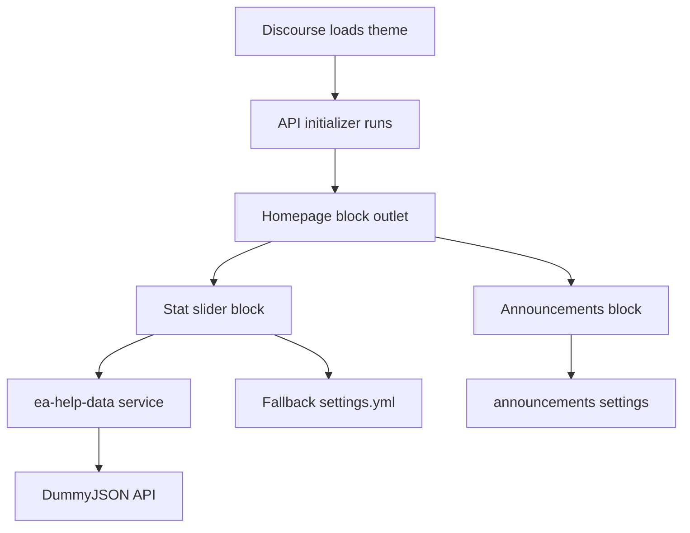

This is a Discourse theme, not a standalone React app. Discourse owns the application, routing, data, rendering, and build system. Your theme injects JavaScript components, CSS, settings, and translations into that existing app.



**Theme Entry Points**

- `about.json` defines metadata, color schemes, SVG icons, and theme modifiers.
- `settings.yml` defines admin-configurable settings.
- `en.yml` contains translated setting descriptions and UI text.
- `common.scss` is the main Sass entry point.
- `package.json` only provides scripts such as `npm run watch`; it does not run a React bundler.

The theme CLI compiles and uploads these files to the Discourse server while `discourse_theme watch .` is running.

**React-to-Ember Mapping**

| React | Ember/Glimmer |
|---|---|
| Function/class component | `Component` class with an inline `<template>` |
| Props | `@args`, accessed through `this.args` or `@property` |
| `useState` | `@tracked` properties |
| Derived state / selectors | Getters such as `get filteredStats()` |
| Context/provider | Injected Ember `@service` |
| `useEffect` | Modifiers such as `didInsert` and `didUpdate` |
| Event handler | `@action` method with `{{on "click" ...}}` |
| JSX | Glimmer template syntax |
| React Router | Discourse router service and Discourse route URLs |

For example:

```js
@tracked isAtStart = true;

@action
scrollNext() {
  this.scrollByPage(1);
}
```

This is conceptually similar to:

```jsx
const [isAtStart, setIsAtStart] = useState(true);

function scrollNext() {
  scrollByPage(1);
}
```

**Homepage Flow**

`homepage-blocks.gjs` is the homepage entry point:

```js
api.renderBlocks("homepage-blocks", [
  { block: BlockStatSlider, id: "ea-stat-slider" },
  { block: BlockAnnouncements, id: "ea-announcements" },
]);
```

The `homepage-blocks` outlet is a location provided by Discourse. The first block is rendered before the second block. This array controls the code-defined order; there is no standard admin drag-and-drop editor for these blocks.

Each block is registered with:

```js
@block("theme:ea-demo:announcements", {
  description: "..."
})
```

The `@block` decorator registers the class with Discourse's block system. The `api.renderBlocks()` call then places it into the homepage outlet.

**Stat Slider**

`block-stat-slider.gjs` does four things:

1. Injects the Discourse category service and the shared EA Help service:

```js
@service site;
@service eaHelpData;
```

2. Loads the API through `didInsert`.

3. Uses API game cards when available:

```js
const apiCards = this.eaHelpData.helpByGameCards;
```

4. Falls back to `settings.stat_slider_display_stats` if API cards are unavailable.

It also owns horizontal scrolling. `isAtStart` and `isAtEnd` are reactive state values, while `setupScroller`, `scrollPrevious`, and `scrollNext` control the DOM element.

**Shared API Service**

`ea-help-data.js` is similar to a React Context provider, but it is application-wide rather than tree-scoped.

```js
@service eaHelpData;
```

Every component receives the same singleton service instance. `loadPromise` prevents duplicate requests:

```js
if (this.loadPromise) {
  return this.loadPromise;
}
```

Therefore, three homepage components can call `eaHelpData.load()`, but only one network request is made. The service stores the complete API response in tracked `sectionObjects`, then exposes convenient getters such as `helpByGameCards`.

To add another API-driven component:

```js
@service eaHelpData;

@action
loadData() {
  this.eaHelpData.load();
}

get newsCards() {
  const news = this.eaHelpData.sectionByType("NewsSection");
  return news?.data?.news || [];
}
```

**Announcements**

`block-announcements.gjs` reads the `announcements` objects setting, converts each object into a card, chooses one hero card, and places the others into the small-card grid.

The associated `block-announcements.scss` creates:

- A large hero card on the left.
- A two-column small-card grid on the right.
- A responsive stacked layout on small screens.
- Image area above a dark footer containing subtitle and title.

The admin controls card data through `settings.yml`, including `title`, `subtitle`, `size`, `image`, and `link`.

**Settings Flow**

A setting defined in `settings.yml` becomes available globally:

```js
settings.announcements
settings.stat_slider_title
settings.category_sections
```

For category settings, Discourse stores category IDs. The block resolves those IDs through:

```js
this.site.categories
```

That is why `category_sections` and the stat slider need both `@service site` and a category resolver.

**CSS Flow**

`common.scss` imports the theme styles:

```scss
@import "brand";
@import "app";
@import "components";
@import "blocks";
```

Each folder has an `_index.scss` that imports its individual files. For a new block:

1. Create `block-example.gjs`.
2. Register it with `@block`.
3. Add it to `homepage-blocks.gjs`.
4. Create `block-example.scss`.
5. Import it from `_index.scss`.
6. Add settings to `settings.yml` if needed.
7. Add descriptions or labels to `en.yml`.

**Two Current Issues to Know**

The stat slider currently places `didInsert this.loadHelpData` inside:

```hbs
{{#if this.filteredStats.length}}
```

If both the API data and fallback settings are initially empty, the block does not render, so `didInsert` never fires and the API request never starts. The load trigger should be placed on an always-rendered wrapper.

Also, `block-stat-slider.gjs` still contains debug `console.log` calls. Those should be removed before production.

Finally, `announcements_shuffle` currently recalculates the shuffled array whenever the `cards` getter is accessed. For stable shuffled output, generate the shuffled list once and store it in a tracked property instead of shuffling during every getter call.

Created 4 todos
